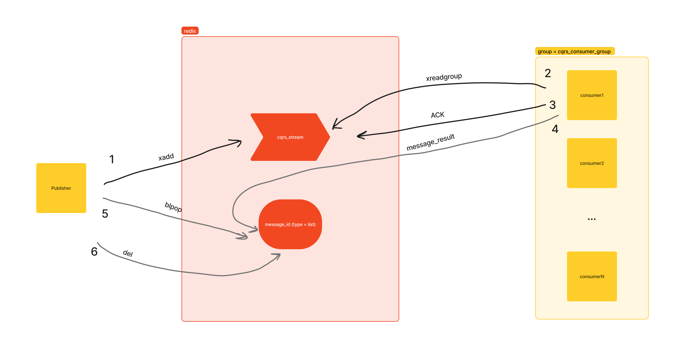

### Вопрос: Что я хотел сделать этим проектом?

**Ответ:** Я хотел реализовать как синхронное общение (_SyncCommand_, _Query_), так и асинхронное общение (_Event_, _AsyncCommand_) при помощи RedisStreams

Существующее решение не для прода и имеет проблемы:

- Мне очень не нравится создавать списки под "ответы". При этом эти списки чистятся на стороне публищера. Если он перестал работать, то эти списки не будут очищены. Тут много над чем еще можно подумать.
- Мне не нравится операции N + 1 при обработке сообщений и создание "ответов"

Весь процесс показан на рисунке:

1. Publisher отправляет сообщение в стрим _cqrs_stream_.
2. Consumer из группы _cqrs_consumer_group_ читает пачку сообщений из того же стрима.
3. После обработки пачки сообщений у нас появляются две корзины:
   1. Сообщения, которые были обработаны успешно. Для таких сообщение просто посылается ACK.
   2. Сообщения, обработка которых завершилась ошибкой. Я решил, что такие сообщения я хочу возвращать обратно в стрим. Для этого посылается ACK, а затем XADD.

В случае, если у нас сообщение синхронного типа, то: 

4. Для возвращения _message_result_ в редис дб создается список. В этот список кладется сообщение. Имя списка = идентификатор сообщения, которое было определено на стороне publisher`а.
5. Publisher читает единственное сообщение в этом списке (блокирующий вариант) и затем удаляет этот список.

### Выводы:

Я хотел понять как можно реализовать синхронное и асинхронное общение на примере Redis, теперь я хочу попробовать реализовать тоже самое, но через Kafka
